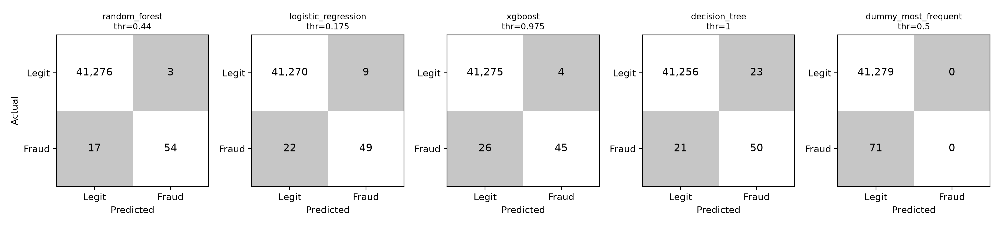

# Chapter 5: Results

## 5.1 Baseline Performance (no imbalance handling)
Table 1: including DummyClassifier to demonstrate the accuracy paradox
| Model | Accuracy | AUC-PR | Precision | Recall | F1 | MCC |

## 5.2 Technique Comparison
Table 2: mean ± std across 5 folds, sorted by AUC-PR
Figure 2: PR curves, top 3 techniques

## 5.3 Statistical Significance
Friedman statistic, p-value, mean ranks; Nemenyi critical difference diagram.
Report where differences fall inside the bootstrap CI — that is itself a finding.

## 5.4 Latency Characterisation  [CONTRIBUTION 2]

> **DRAFT 1 — numbers pending.** `src/inference_profiler.py` is not yet implemented and no technique beyond the untreated baselines has been trained, so every `[TBD]` below is a measurement still to be taken. No latency figure in this section has been measured; nothing here should be quoted until the cells are filled from `experiments/latency_results.csv`.

Accuracy alone does not decide whether an imbalance-handling technique can be deployed. A card-payment authorisation decision is made while the customer waits, so a model that wins on AUC-PR but breaches the response-time budget is not a usable fraud detector. Only 2 of the 21 sources reviewed in Chapter 2 report inference latency at all, and none examine how the choice of imbalance technique affects it (Gap 1). This section addresses that gap directly.

### 5.4.1 Protocol

Each fitted model was scored on a single transaction at a time, since a production API receives one request per authorisation rather than a batch. Following the protocol fixed in Chapter 3, each model received at least 100 discarded warm-up predictions to absorb lazy allocation and cache effects, followed by `N_LATENCY_TRIALS` = 1,000 timed calls using `time.perf_counter()` on randomly drawn validation rows. Because latency distributions are right-skewed, medians and upper percentiles are reported rather than means: p50, p95 and p99. BLAS and OpenMP threading was pinned to one thread (`OMP_NUM_THREADS=1`) so that techniques are comparable and not dependent on core count. Hardware, Python version and library versions are recorded in Table 3's caption [TBD: CPU model, cores, RAM, Python/scikit-learn/XGBoost/LightGBM versions]. The deployment budget is a p99 of 100 ms (`LATENCY_BUDGET_MS`), chosen to sit comfortably inside typical card-network authorisation windows; p99 rather than the median is the binding statistic because a fraud service is judged by its slow tail, not its typical call.

Latency was measured on the model object alone, excluding network, serialisation and web-framework overhead. End-to-end latency through the FastAPI service (Chapter 4) is therefore higher, and is reported separately in §5.4.4 [TBD].

### 5.4.2 Results

Table 3 reports, for every technique, fit time, p50/p95/p99 single-record latency, and serialised model size.

| Technique | Base model | Fit time (s) | p50 (ms) | p95 (ms) | p99 (ms) | Size (MB) |
|---|---|---|---|---|---|---|
| none | [TBD] | [TBD] | [TBD] | [TBD] | [TBD] | [TBD] |
| random_undersampling | [TBD] | [TBD] | [TBD] | [TBD] | [TBD] | [TBD] |
| smote | [TBD] | [TBD] | [TBD] | [TBD] | [TBD] | [TBD] |
| … (15 techniques) | | | | | | |
| easy_ensemble | [TBD] | [TBD] | [TBD] | [TBD] | [TBD] | [TBD] |

*Table 3: Fit time and single-record inference latency by technique. Rows to be generated by `src/inference_profiler.py`.*

Figure 8 plots validation AUC-PR against p99 latency for every technique, with the 100 ms budget drawn as a vertical line (generated by `scripts/plot_fig8_latency.py`). Techniques in the upper-left quadrant are both accurate and deployable. [TBD: describe which techniques fall left of the line and which, if any, do not.]

### 5.4.3 Interpretation

The central hypothesis, stated in Chapter 3 before any measurement, is that resampling is free at inference time while ensembles are not. The reasoning is mechanical. Random under- and over-sampling, SMOTE and its variants, ADASYN and SOA-S change only the *training set*. The fitted model is the same kind of object as an untreated one, so a SMOTE-trained logistic regression performs the same dot product at inference as its untreated counterpart. Class-weighting and scale-position weighting likewise alter the loss during training, not the structure of the model. Ensemble-style techniques differ: EasyEnsemble fits many independent learners on balanced subsets and must evaluate all of them for every prediction, and RUSBoost and Balanced Random Forest carry similar per-prediction cost proportional to ensemble size.

If the measurements support this, the practical conclusion is sharp: resampling can be chosen purely on predictive merit, whereas an ensemble must earn a higher accuracy gain to justify its inference cost. [TBD: confirm or refute, and quantify, e.g. "EasyEnsemble p99 was N× that of the matched untreated base model"]. Two outcomes would qualify the hypothesis and should be reported rather than smoothed over: (i) if resampled and untreated models of the same family differ in latency, the cause is almost certainly model *size* — SMOTE-trained tree models typically grow deeper because oversampled minorities create more splits, and deeper trees cost more per prediction; and (ii) if every technique comfortably meets 100 ms, the finding is that latency is not the binding constraint for this dataset and feature count, which is itself useful to a practitioner.

Fit time is reported separately because it matters operationally for retraining, not for scoring. Resampling inflates training time (oversampling enlarges the training set; SMOTE-ENN adds a nearest-neighbour cleaning pass), while undersampling shrinks it. [TBD: report the fit-time ordering.]

### 5.4.4 Limitations

Latency was measured on a single machine; absolute numbers will differ in production, so the *ordering* and *ratios* between techniques are the transferable result rather than the milliseconds. The dataset has 29 features, so the findings do not necessarily extend to high-dimensional production feature sets. The measured path excludes feature retrieval, which in real systems is often the dominant cost. Finally, p99 from 1,000 trials rests on roughly ten slow observations and is itself noisy; a bootstrap interval on p99 [TBD] should accompany Table 3.

## 5.5 Error Analysis

> **DRAFT 1.** Confusion matrices and costs below are exact, recovered from Table 1 by `scripts/confusion_from_table1.py`. They cover the **untreated baselines only**, on the **validation** split. Matrices for the 15 techniques, and any analysis of *which* frauds are missed, require the experiment sweep and per-row scores [TBD].

Aggregate metrics hide the structure of a detector's errors. Two models with similar F1 can differ greatly in the *kind* of mistake they make, and under asymmetric costs that difference decides which is preferable. This section examines the confusion matrices of the baselines, then how the decision threshold shapes them.

### 5.5.1 Confusion matrices

The validation split contains 41,350 transactions, of which 71 are fraudulent (1:581). Table 4 and Figure 9 give the cells at each model's validation-chosen threshold.

| Model | Threshold | TP | FP | FN | TN | Alerts | Cost |
|---|---|---|---|---|---|---|---|
| random_forest | 0.440 | 54 | 3 | 17 | 41,276 | 57 | 1,715 |
| logistic_regression | 0.175 | 49 | 9 | 22 | 41,270 | 58 | 2,245 |
| xgboost | 0.975 | 45 | 4 | 26 | 41,275 | 49 | 2,620 |
| decision_tree | 1.000 | 50 | 23 | 21 | 41,256 | 73 | 2,215 |
| dummy_most_frequent | 0.500 | 0 | 0 | 71 | 41,279 | 0 | 7,100 |

*Table 4: Validation confusion matrices (stratified split, seed 42). Cost = 100 × FN + 5 × FP (`COST_FN`, `COST_FP`; indicative, sensitivity-tested in Chapter 6).*

*Figure 9: Confusion matrices for the untreated baselines at validation-chosen thresholds.*

Three observations follow. First, the tabulated errors are overwhelmingly false negatives, not false positives. The dummy classifier's matrix makes the accuracy paradox concrete: it is correct on 41,279 of 41,350 transactions (99.83%) while detecting nothing. Second, the supervised models differ more in their false positives than their false negatives. Random Forest raises 3 false alarms against 17 misses; the decision tree catches 50 frauds but raises 23 false alarms, consuming analyst time at a precision of 68.5% compared with 94.7%. Third, under the cost model Random Forest is cheapest (1,715) and the decision tree edges logistic regression (2,215 versus 2,245) despite its lower AUC-PR, because the 20:1 cost ratio rewards recall.

The scale of these differences needs care. With 71 frauds, one transaction moves recall by 1.4 percentage points; Random Forest and logistic regression differ by five true positives. These gaps are indicative and should be read alongside the bootstrap intervals of §5.3.

### 5.5.2 Threshold discussion

The thresholds in Table 4 show why a 0.5 default is unsafe under extreme imbalance. Logistic regression's best F1 occurs at 0.175, well below 0.5, because its probabilities are compressed toward the majority class. XGBoost's optimum is 0.975, far above it, because boosted scores are strongly separated and overconfident. Random Forest lands near 0.44. The same nominal cut-off would therefore mean very different things across models, which is why thresholds are chosen per model on validation (CLAUDE.md rule 3) and never fixed globally.

The decision tree's threshold of exactly 1.000 is a warning sign rather than a result. A fully grown tree outputs probabilities of 0 or 1 from pure leaves, so the score has almost no gradation and the "threshold" simply selects leaves that are entirely fraud. Its precision-at-100 of 0.50 equals its recall-at-100 count of 50, meaning that expanding from 73 alerts to 100 added no frauds: ranking below the pure leaves is essentially arbitrary.

The alert budget supplies a second view. At the 100-alert capacity (`ALERT_BUDGET`), Random Forest recovers 56 frauds, versus 54 at its F1 threshold with 57 alerts, so the extra 43 alerts yielded two further frauds (marginal precision 4.7%). Logistic regression gains five frauds for 42 additional alerts, and XGBoost five for 51. Whether that marginal yield is worth the review effort is a business decision; the cost ratio gives it a formal basis, and the break-even marginal precision under 100:5 costs is 5%, essentially where Random Forest sits.

Two caveats govern all of the above. These thresholds were selected on the validation split and evaluated on it, so the matrices are optimistic; the held-out test result is the figure to report in the final dissertation. And the thresholds optimise F1, whereas the cost model weights a missed fraud 20 times a false alarm. A cost-optimal threshold would be lower and would trade more false positives for fewer misses [TBD: recompute with `choose_threshold(objective="cost")` and report the shift].

### 5.5.3 What remains

Still outstanding are (i) matrices for all 15 techniques, where I expect resampling to lower thresholds and raise false positives relative to the baselines, as it shifts probability mass toward the minority class; and (ii) a profile of missed frauds (amount, PCA component distribution) to test whether false negatives cluster in particular transaction types. Because V1–V28 are anonymised, any such characterisation will be statistical rather than interpretable, a limitation acknowledged in §5.6 and Chapter 6.

## 5.7 Sensitivity Analyses
Duplicates retained vs removed; temporal vs stratified split.
