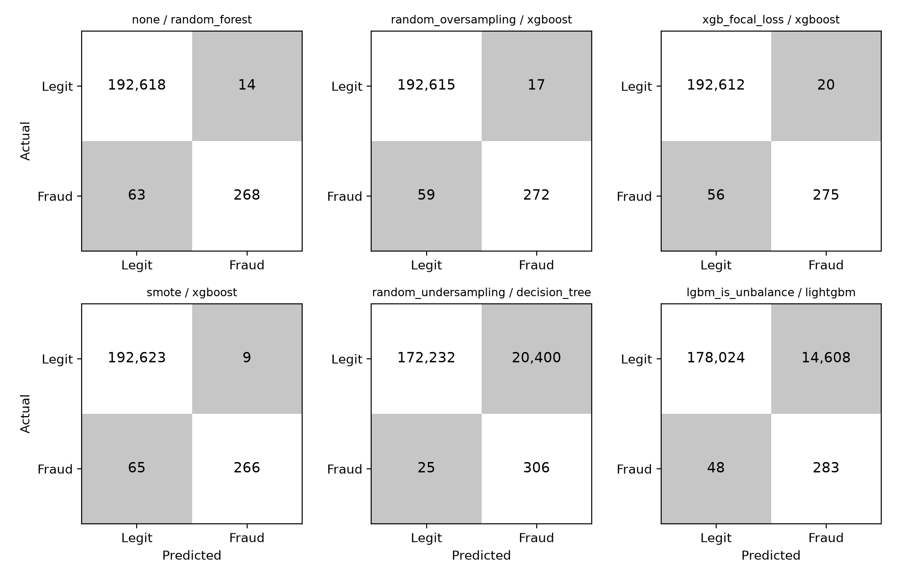

# Chapter 5: Results

## 5.1 Baseline Performance (no imbalance handling)
Table 1: including DummyClassifier to demonstrate the accuracy paradox
| Model | Accuracy | AUC-PR | Precision | Recall | F1 | MCC |

## 5.2 Technique Comparison
Table 2: mean ± std across 5 folds, sorted by AUC-PR
Figure 2: PR curves, top 3 techniques

## 5.3 Statistical Significance
Friedman statistic, p-value, mean ranks; Nemenyi critical difference diagram.
Report where differences fall inside the bootstrap CI — that is itself a finding.

## 5.4 Latency Characterisation  [CONTRIBUTION 2]

> **DRAFT 1.** All numbers come from `experiments/latency_results.csv` (profiler, batch size 1) and `experiments/results_raw.csv`. Table 3 is `dissertation/tables/table3_latency.csv`; Figure 8 is `dissertation/figures/fig8_auc_pr_vs_latency.png`. `smote_tomek` and `smote_enn` rows are excluded from every claim below: the committed sweep predates the fix that made those cleaners actually clean (the `smote_tomek` rows are numerically identical to `smote`), so they must be re-run (`experiment_runner --rerun`) before being quoted.

Predictive accuracy alone does not decide whether an imbalance-handling technique can be deployed. A card-payment authorisation is made while the customer waits, so a detector that wins on AUC-PR but breaches the response-time budget is not usable. Only 2 of the 21 sources reviewed in Chapter 2 report inference latency, and none examine how the choice of imbalance technique affects it (Gap 1). This section addresses that gap.

### 5.4.1 Protocol

Each of the 41 fitted (technique, classifier) pairs was scored one transaction at a time, since a production API receives one request per authorisation. Following Chapter 3, each pair received 100 discarded warm-up calls and then 1,000 timed calls (`time.perf_counter()`, garbage collection disabled during timing) on rows drawn at random from the validation split. Because latency is right-skewed, p50, p95 and p99 are reported rather than the mean. BLAS and OpenMP threads were limited to one at run time (`threadpoolctl`; recorded as `threads_during_timing = 1`), so that no result depends on core count; a CPU-to-wall-time check flags any row where pinning failed. Hardware and software are recorded in `experiments/latency_environment.json`: Apple M1 Pro (8 cores, 16 GB), macOS, Python 3.13.6, scikit-learn 1.9.0, XGBoost 3.4.1, LightGBM 4.7.0. The budget is a p99 of 100 ms (`LATENCY_BUDGET_MS`); p99 rather than the median is binding because a fraud service is judged on its slow tail.

Latency is for the model object alone, excluding network, serialisation and web-framework overhead; end-to-end latency through the FastAPI service (Chapter 4) is higher and is reported separately [TBD].

### 5.4.2 Results

Every one of the 41 pairs meets the budget. The slowest, EasyEnsemble, has a p99 of 35.9 ms (36% of the budget); the next slowest, Balanced Random Forest and the Random Forest variants, sit between 3.7 and 7.2 ms; the remaining 30 pairs are all below 1 ms. Figure 8 plots CV AUC-PR against p99 latency, with the budget as a vertical line. Latency forms three clusters set by the *classifier*, not the treatment:

| Classifier | p50 range across treatments (ms) | Model size range (MB) |
|---|---|---|
| Logistic regression | 0.054 – 0.055 | 0.0008 – 0.0009 |
| Decision tree | 0.047 – 0.049 | 0.006 – 0.090 |
| XGBoost | 0.076 – 0.080 | 0.10 – 0.29 |
| Random forest | 3.3 – 3.6 | 0.45 – 10.7 |
| AdaBoost (EasyEnsemble) | 28.9 | 0.32 |

*Table 3 (summary; full per-pair table in `table3_latency.csv`): single-record p50 latency and serialised model size. Treatments within a classifier differ by at most a few percent in p50.*

The most accurate region of Figure 8 contains XGBoost pairs at p99 ≈ 0.14–0.23 ms with CV AUC-PR 0.85–0.86 (for example random oversampling, 0.861 at 0.16 ms, and focal loss, 0.856 at 0.14 ms). Random Forest pairs reach the same AUC-PR (0.84–0.85) but at roughly 4 ms, about 25 times slower, so the extra inference cost buys no accuracy. EasyEnsemble is both the slowest (35.9 ms) and well below the leaders in accuracy (0.713).

### 5.4.3 Interpretation

The hypothesis stated in Chapter 3, that resampling is free at inference while ensembles are not, is supported, with one qualification. Data-level techniques change only the training set, and the data confirm it: within each classifier, the p50 of every resampled model lies within about 5% of the untreated one (e.g. logistic regression 0.0542 ms untreated against 0.0539–0.0546 under resampling; Random Forest 3.44 ms untreated against 3.32–3.53 ms). Class-weighting and scale-positive weighting behave the same way. The cost is concentrated in the *algorithm-level ensembles* that multiply the model count: EasyEnsemble's p50 is about 530 times logistic regression's, and a 100-tree Random Forest is about 44 times XGBoost's.

The qualification is model size. Resampling changes what is *stored*: SMOTE inflates a Random Forest from 1.7 MB (untreated) to 10.7 MB, a 6.3-fold increase, and a SMOTE decision tree is five times the size of an untreated one. Yet inference time is unchanged, because per-prediction cost depends on tree depth, which grows slowly with node count. Size therefore matters for memory and load time (relevant to container cold starts) but not for per-request latency.

One caution on reading p99. Within a classifier, p50 is stable to a few percent while p99 varies by a factor of two to three (logistic regression: 0.065–0.174 ms). With 1,000 trials p99 rests on about ten observations and is dominated by scheduler and cache outliers, so horizontal spread *within* a classifier cluster in Figure 8 is measurement noise, not a technique effect. Across clusters the differences (10× to 500×) are far larger than this noise. A bootstrap interval on p99 [TBD] should accompany the final table.

Fit time is the one place resampling is not free. For Random Forest, mean per-fold fit time rises from 13.0 s untreated to 22.4 s under SMOTE and 29.9 s under ADASYN, while random undersampling cuts it to 0.09 s. XGBoost moves little (0.72 s to 0.88 s under SMOTE). This matters for retraining cadence, not for scoring.

### 5.4.4 Limitations

Absolute figures are from one laptop-class CPU; the transferable results are the *ordering* and the *ratios*. The dataset has 29 features, and findings may not extend to wide production feature sets. The measured path excludes feature retrieval, often the dominant real cost. Finally, because every pair clears the budget, latency does not discriminate among techniques *within* a classifier on this dataset; its practical effect is on classifier choice. That is itself a useful result for practitioners: the deployability question is answered by the model family, and the imbalance technique can be chosen on predictive and operational merit.

## 5.5 Error Analysis

> **DRAFT 1.** Matrices are pooled over the five training-split CV folds (`experiments/results_raw.csv`; 331 frauds, 192,632 legitimate), generated by `scripts/confusion_cv.py` (Table 7, Figure 9). Thresholds were chosen on the scored fold, so every threshold-dependent number here is **optimistic**. Test-split matrices and operating points (Tables 5 and 6, `notebooks/03_results_analysis.ipynb`) need `data/raw/creditcard.csv` and have not been run in this environment [TBD]. Cost = 100 × FN + 5 × FP (`COST_FN`, `COST_FP`; indicative, sensitivity-tested in Chapter 6).

Aggregate metrics hide the structure of a detector's errors. Two models with similar F1 can differ greatly in the *kind* of mistake they make, and under asymmetric costs that decides which is preferable.

### 5.5.1 Confusion matrices

| Technique / classifier | AUC-PR | TP | FP | FN | TN | Cost |
|---|---|---|---|---|---|---|
| none / random forest (best untreated) | 0.845 | 268 | 14 | 63 | 192,618 | 6,370 |
| random oversampling / XGBoost (best AUC-PR) | 0.861 | 272 | 17 | 59 | 192,615 | 5,985 |
| focal loss / XGBoost (lowest cost) | 0.856 | 275 | 20 | 56 | 192,612 | 5,700 |
| SMOTE / XGBoost | 0.851 | 266 | 9 | 65 | 192,623 | 6,545 |
| random undersampling / decision tree | 0.014 | 306 | 20,400 | 25 | 172,232 | 104,500 |
| LightGBM `is_unbalance` | 0.024 | 283 | 14,608 | 48 | 178,024 | 77,840 |

*Table 7: Pooled CV confusion matrices for six illustrative pairs.*

*Figure 9: The matrices of Table 7.*

Three patterns stand out. **First, the leading models are close.** The best pairs miss 56–65 of 331 frauds and raise only 9–20 false alarms. Against the best untreated model, the best treated one catches 4 more frauds (272 against 268), about 1.2 percentage points of recall, at the price of 3 more false alarms. With a fold-to-fold AUC-PR standard deviation of about 0.03, this is consistent with the literature's finding that no technique wins consistently, and it should be read next to the intervals of §5.3. **Second, false negatives drive cost.** In the lowest-cost pair, misses account for 5,600 of 5,700 cost units (98%), so cost differences among good models are differences in missed fraud. Each well-performing model misses roughly one fraud in six (17–20%); whether these are the *same* transactions cannot be established because row-level predictions were not stored [TBD: persist scores to test this and to profile the misses by amount and PCA component]. **Third, the failure cases fail by false positives.** Random undersampling with a decision tree attains the highest recall (306 of 331, 92%) but at 20,400 false alarms, a precision of 1.5% and a cost 18 times that of the best pair.

### 5.5.2 Threshold discussion

Thresholds were chosen per fold to maximise F1 (`choose_threshold`, rule 3), and they differ enormously between pairs. Untreated logistic regression's best cut is 0.074 on average (range 0.055–0.096), far below 0.5: its probabilities are compressed toward the 0.17% prior. Under oversampling or SMOTE the same classifier's best cut is 1.000 in every fold, and SMOTE/XGBoost's is 0.982. Resampling rebalances the training prior, which inflates the predicted probabilities, and the optimal cut-off moves up to compensate. This is the familiar equivalence of resampling and threshold shifting (Elkan, 2001), and it explains why a fixed 0.5 would misjudge both groups: too high for the untreated, too low for the resampled. Thresholds are therefore not comparable across techniques and must always be tuned per model on validation.

Two warning signs are visible. The first is **instability**: random oversampling/XGBoost's optimal cut ranges from 0.129 to 0.967 across folds (standard deviation 0.32), yet its F1 is almost constant, which suggests a flat optimum that the F1 criterion resolves arbitrarily [TBD: confirm with the threshold sweep of notebook Table 6]. A threshold fixed from a single validation split would therefore carry real sampling noise. The second is **saturation**: where the optimal threshold is exactly 1.000 (decision trees, LightGBM, and most logistic-regression variants), scores take few distinct values near 1, so there is no ranking granularity and any cut below 1 raises a flood of alerts. The 14,608 false alarms of LightGBM's defaults are this effect, not evidence that class weighting is poor in itself.

The alert budget gives a second view. At the 100-alert capacity (`ALERT_BUDGET`), the leading pairs achieve precision@100 of 0.57 and recall@100 of 0.86, against recall of 0.81–0.83 at their F1 thresholds with 56–59 alerts. About 40 extra alerts therefore recover roughly three more frauds per fold, a marginal precision of about 6–7%, just above the 5% break-even implied by the 100:5 cost ratio. So with these indicative costs the larger budget is mildly worthwhile; a different cost ratio would flip that, which is why Chapter 6 sensitivity-tests it.

Two caveats govern all of this. Matrices from the scored fold are optimistic, and F1-optimal thresholds are not cost-optimal: with a 20:1 cost ratio the cost-minimising threshold lies lower, trading more false positives for fewer misses [TBD: Table 6 operating points on test].

## 5.6 Explainability (scope-limited)
SHAP on the selected model. Note the PCA constraint on interpretation.

## 5.7 Sensitivity Analyses
Duplicates retained vs removed; temporal vs stratified split.
